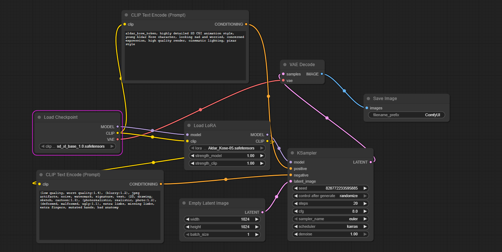

# Aldar Kose LoRa Project

Этот проект содержит LoRa-модель, обученную на персонаже "Алдар Косе" для **Stable Diffusion **
 

*Важно : проект был создан за 24 часа в период хакатона от Higgsfield*
---

## Пайплайн для генерации (ComfyUI)

Ниже представлена структура узлов (workflow) в ComfyUI, которая использовалась для генерации изображений с помощью этой модели.

---

## Примеры сгенерированных изображений

Здесь показаны примеры изображений, созданных с помощью данной LoRa-модели.

| Frame 1 | Frame 2 | Frame 3 |
| :---: | :---: | :---: |
| *([aldar_kose_token] Вид снизу: Бай возвышается над Алдаром Косе, стиль: 3D animation render, CGI style, smooth textures. Его лицо искажено жадностью, он тянет руки к яйцу. Алдар слегка отстраняется, хитро приподняв бровь.)* | .jpg)*([aldar_kose_token] Вид снизу: Бай возвышается над Алдаром Косе, стиль: 3D animation render, CGI style, smooth textures. Его лицо искажено жадностью, глаза горят алчным блеском, руки тянутся к сияющему «золотому яйцу». Алдар слегка отстраняется назад, хитро приподняв бровь и улыбаясь уголком губ. Рядом стоит овца, спокойно глядя в сторону. На фоне — интерьер богатой юрты с коврами и сундуками, а у входа видны силуэты любопытных слуг.)*| .jpg)*([aldar_kose_token] Общий план: Алдар Косе держит в руках блестящее «золотое яйцо», стиль: 3D animation render, CGI style, smooth textures. Бай наклоняется вперёд, глаза широко раскрыты от удивления. Слуги Бая переглядываются позади.)* |

---

## Конфигурация обучения

Модель была обучена со следующими параметрами:

-   **Базовая модель**: Stable Diffusion SDXL
-   **Метод**: LoRa
-   **Оптимизатор (Optimizer)**: `AdamW`
-   **Размер батча (Batch Size)**: `2`
-   **Скорость обучения UNet (unet_lr)**: `5e-4`
-   **Скорость обучения Text Encoder (text_encoder_lr)**: `1e-3`
-   **Планировщик скорости обучения (LR Scheduler)**: `cosine_with_restarts`
-   **Количество перезапусков планировщика**: `5`
